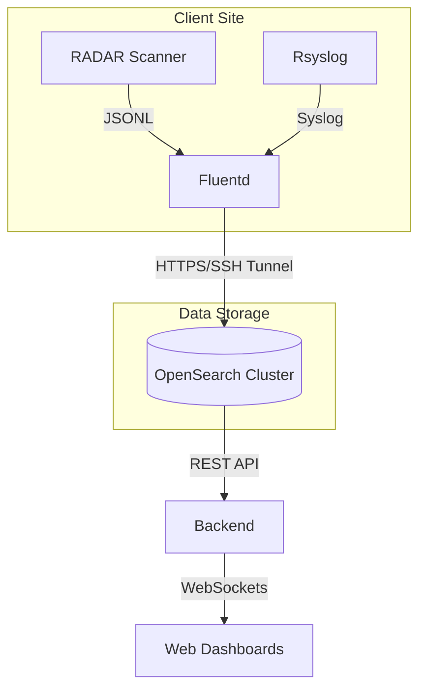

# 🏢 Forensic CyberTech Documentations

<div align="center">
  
</div>

> **Enterprise-grade documentation platform for network security, monitoring, and operations infrastructure**

---

## 🌟 Welcome

Welcome to **Forensic CyberTech documentation hub** — your comprehensive resource for understanding and deploying enterprise-grade network security and operations platforms.

### What We Offer
Our platform provides:
- 🔍 **Network Discovery** - Multi-protocol device discovery and inventory management
- 🛡️ **Security Operations** - Centralized log collection and SOC infrastructure
- 📊 **Analytics & Insights** - Real-time topology mapping and threat detection
- 🎯 **Enterprise-Grade** - Production-ready deployments at scale

---

## 📚 Our Products

<div style="border: 1px solid #334155; border-radius: 8px; padding: 20px; background: #1e293b; margin: 20px 0;">
  <h3>🦅 PROJECT 1: EAGLEYE RADAR</h3>
  <p><strong>Network Discovery & Security Operations Platform</strong></p>
  
  <p>✨ <strong>Key Features:</strong></p>
  <ul>
    <li>Multi-protocol device discovery (SNMP, ARP, LLDP, CDP)</li>
    <li>Centralized syslog collection & processing</li>
    <li>Real-time network topology visualization</li>
    <li>Comprehensive device inventory management</li>
    <li>Security compliance & vulnerability tracking</li>
    <li>Production-grade reliability & scalability</li>
  </ul>

  <br>
  <a href="#01-eagleye-radar/01-introduction.md" style="display: inline-block; padding: 10px 20px; background: #3b82f6; color: white; text-decoration: none; border-radius: 4px; font-weight: bold;">📖 VIEW DOCUMENTATION →</a>
  <br><br>
  <hr style="border-color: #334155;">
  <p><em>[Additional Projects Coming Soon...]</em></p>
</div>

---

## 🚀 Quick Navigation

### For New Users
- [Getting Started](#01-eagleye-radar/01-introduction.md#-quick-start) - Begin your journey
- [System Requirements](#01-eagleye-radar/01-introduction.md#-prerequisites) - Pre-deployment checklist
- [Installation Guide](#01-eagleye-radar/01-introduction.md#-installation) - Step-by-step setup
- [First Steps](#01-eagleye-radar/01-introduction.md#-usage) - Run your first scan

### For Advanced Users
- [Architecture Documentation](#01-eagleye-radar/01-introduction.md#-architecture) - Deep technical dive
- [Configuration Reference](#01-eagleye-radar/01-introduction.md#-configuration) - Advanced tuning
- [Troubleshooting](#01-eagleye-radar/02-troubleshooting.md) - Common issues & solutions

---

## 🦅 EAGLEYE RADAR - Complete Overview

### What is EAGLEYE RADAR?
**EAGLEYE RADAR** is a production-grade network discovery and monitoring platform that provides:

1. **Automated Network Discovery** - Discovers all devices across your network without manual configuration
2. **Security Operations** - Centralized log collection from firewalls, routers, and switches
3. **Topology Mapping** - Visual representation of Layer 2/3 network connections
4. **Compliance Tracking** - Monitor device configurations and security posture
5. **Real-Time Dashboards** - Live visibility into network inventory and threat indicators

### System Architecture



---

## Key Features

### 🔍 Discovery Engine
- **Multi-Protocol Support**: SNMP (v1/v2c/v3), LLDP, CDP, ARP, DHCP, NetBIOS, mDNS
- **Intelligent Caching**: 10x faster with vendor-specific optimizations
- **Automatic Fallback**: Smart SNMP version detection per device
- **Parallel Scanning**: 50-thread pool for concurrent discovery
- **Rate Limiting**: 5 SNMP queries/sec to avoid IDS triggers

### 📊 Data Pipeline
- **Streaming Architecture**: JSONL append-only format (no overwrites)
- **Position Tracking**: Prevents duplicate log ingestion
- **Buffer Persistence**: Survives service restarts
- **Exponential Backoff**: 17 retry attempts with intelligent delays
- **Bulk Operations**: 10MB chunks for efficient OpenSearch writes

### 🎨 Visibility & Analysis
- **Topology Mapping**: Auto-generated Layer 2/3 network diagrams
- **Blind Spot Detection**: Identifies network visibility gaps
- **Security Assessment**: Vulnerability scanning and compliance checks
- **Historical Tracking**: Scan-based versioning for trend analysis
- **Real-Time Dashboards**: Live auto-refresh with custom filtering

### 🛡️ Production-Ready
- **Systemd Integration**: Auto-restart with 15-second recovery
- **Checkpoint Resume**: Crash recovery for large scans
- **Graceful Degradation**: Fallback when optional tools unavailable
- **Comprehensive Logging**: Structured logs for audit & debugging
- **Enterprise Reliability**: Zero-data-loss design patterns

---

## 📋 Getting Started

### System Requirements

**Minimum Specifications:**
- **OS**: Ubuntu 20.04 LTS or Debian 11 (Linux recommended)
- **CPU**: 2+ cores for scanner service
- **RAM**: 4GB minimum, 8GB recommended
- **Storage**: 50GB+ for OpenSearch data retention
- **Network**: SNMP access to devices, syslog port access (UDP 514, TCP 514, RELP 20514)
- **OpenSearch**: 7.10+ cluster (running separately)

**Supported Operating Systems:**
- Ubuntu 20.04, 20.10, 21.04, 21.10, 22.04 LTS
- Debian 10, 11, 12
- RHEL/CentOS 8+

**Optional but Recommended:**
- Docker for containerized deployment
- Kubernetes for multi-site deployments
- Grafana for advanced visualization

### Installation

#### Option 1: Automated Installer (Recommended)
```bash
# Clone repository
git clone https://github.com/darshanfct/RADAR-Scanner.git
cd RADAR-Scanner

# Run unified installer
sudo bash SETUP_SOC.sh
```

**What the installer does:**
- ✅ Detects existing installations
- ✅ Validates system requirements
- ✅ Installs all dependencies
- ✅ Configures services
- ✅ Tests connectivity
- ✅ Starts services

#### Option 2: Manual Installation
```bash
# Install Rsyslog
sudo apt update
sudo apt install -y rsyslog

# Install Fluentd
sudo apt install -y ruby ruby-dev
sudo gem install fluentd fluent-plugin-opensearch

# Install EagleEye RADAR
sudo apt install -y python3 python3-venv python3-pip
sudo pip install -r requirements.txt

# Copy systemd services
sudo bash setup_services.sh
```

#### Option 3: Docker Deployment
```bash
docker run -it \
  -e OPENSEARCH_HOST=your-cluster.com \
  -e OPENSEARCH_USER=admin \
  -e OPENSEARCH_PASS=password \
  -v /opt/eagleyeradar:/data \
  darshanfct/eagleye-radar:latest
```

### First Steps

1. **Verify Installation**
   ```bash
   # Check service status
   sudo systemctl status eagleyeradar
   sudo systemctl status fluentd
   sudo systemctl status rsyslog

   # Verify OpenSearch connectivity
   curl -k -u admin:password https://your-cluster:9200
   ```

2. **Configure Your Network**
   Edit `/opt/eagleyeradar/eagleye_config.json`:
   ```json
   {
     "networks": [
       "192.168.1.0/24",
       "10.0.0.0/24"
     ],
     "snmp_community": "public",
     "scan_interval": 600,
     "thread_count": 50
   }
   ```

3. **Run First Scan**
   ```bash
   # Start the service
   sudo systemctl start eagleyeradar

   # Monitor live logs
   sudo journalctl -u eagleyeradar -f

   # View results
   tail -f /opt/eagleyeradar/scan/scan_devices.jsonl
   ```

4. **Access Dashboard**
   - Frontend: `http://localhost:5173`
   - Backend:  `http://localhost:3001`

---

## 📖 Documentation Structure

### Main Documentation
Each project contains comprehensive documentation in its `README.md`:

**EAGLEYE RADAR Sections:**
- 📖 **Overview & Architecture**
- 🚀 **Quick Start & Installation**
- ⚙️ **Configuration & Tuning**
- 💻 **Usage & Operations**
- 🔄 **Data Flow & Processing**
- 📊 **Output Formats & Exports**
- 🔍 **Troubleshooting Guide**
- 🔌 **API Reference & Integration**

### How to Access
**Via Web Interface:**
Visit `http://localhost:8000/docs-site` and navigate using the sidebar

**Via File System:**
Browse `/docs/` directory:
```
docs/
├── 01-eagleye-radar/
│   └── 01-introduction.md          (Comprehensive project documentation)
└── index.json                      (Project configuration)
```

---

## 🎯 Use Cases

### Network Operations
- Automated device inventory management
- Network topology visualization
- SNMP-based monitoring and alerting
- Service discovery and tracking

### Security Operations
- Centralized firewall/router log collection
- Security event correlation and analysis
- Compliance monitoring and reporting
- Threat detection and response

### Network Engineering
- Network documentation and diagrams
- Change management tracking
- Disaster recovery planning
- Vendor management and licensing

### Compliance & Audit
- Network device inventory audits
- Configuration change tracking
- Security posture assessment
- Regulatory compliance reporting

---

## 🔧 Advanced Topics

### Multi-Site Deployment
Deploy across multiple network sites with centralized OpenSearch cluster. See Architecture Documentation for details.

### Integration with Existing Systems
Connect with:
- **SIEM**: Forward logs to Splunk, ELK, or other SIEM
- **Ticketing**: Auto-create incidents for discovered vulnerabilities
- **Monitoring**: Integrate with Nagios, Zabbix, or Prometheus
- **Backup**: Archive to S3, Azure, or on-premise storage

### Custom Scanning Profiles
Create specialized scanning profiles for:
- DevOps environments
- IoT device discovery
- Wireless access point detection
- VoIP system mapping

### Performance Tuning
Optimize for your environment:
- Thread pool sizing
- SNMP timeout adjustment
- Cache configuration
- Buffer memory allocation

---

## 🆘 Getting Help

### Documentation
Complete documentation available in the sidebar →
[**ACCESS DOCUMENTATION**](#01-eagleye-radar/01-introduction.md)

### Troubleshooting
Common issues and solutions:
- Check service status: `sudo systemctl status eagleyeradar`
- View detailed logs: `sudo journalctl -u eagleyeradar -n 100`
- Verify OpenSearch connectivity: `curl -k -u admin:pass https://host:9200`
- See [Troubleshooting Section](#01-eagleye-radar/02-troubleshooting.md) for detailed guidance

### Support
- **Email**: support@forensiccybertech.com
- **Documentation**: [Access Here](#01-eagleye-radar/01-introduction.md)
- **GitHub Issues**: Create issue on repository

---

## 🗂️ Documentation Layout

```
Your Forensic CyberTech Documentation
│
├─ 📄 index.html              (Main web interface)
├─ 📄 README.md               (This file - Home page)
│
├─ /docs/
│   ├─ index.json             (Projects configuration)
│   │
│   └─ 01-eagleye-radar/
│       └─ 01-introduction.md (Complete project documentation)
│
└─ /assets/
    ├─ /css/
    │   └─ style.css          (Enterprise theme styling)
    └─ /js/
        ├─ app.js             (Main application logic)
        ├─ markdown.js        (Markdown rendering)
        └─ search.js          (Full-text search)
```

---

## Documentation Management

The documentation site is **fully automated**. You do NOT need to run any scripts manually.

### Adding New Content
1. **Create Folders/Files**:
   - Create project folders in `docs/` using the numbered prefix format (e.g., `03-new-project`).
   - Add markdown files inside the project folder using the numbered prefix format (e.g., `01-introduction.md`).

2. **Commit & Push**:
   Simply push your changes to the `main` branch.
   ```bash
   git add .
   git commit -m "docs: Add new project"
   git push origin main
   ```

3. **Done!**
   - GitHub Actions will automatically detect your changes.
   - It will run the indexer and update `index.json`.
   - The site will refresh within a few minutes.

### Directory Structure Example
```
docs/
├── 01-eagleye-radar/
│   ├── 01-introduction.md
│   └── 02-troubleshooting.md
├── 02-new-project/
│   └── 01-overview.md
```

---

## 🎓 Learning Path

| Beginner | Intermediate | Advanced |
| :--- | :--- | :--- |
| Read this page (you're here!) | Review Installation Options | Study Architecture |
| Follow Quick Start | Configure for your network | Integrate with existing systems |
| Run first scan | Set up log collection | Deploy multi-site architecture |
| Explore dashboard | Create custom scanning profiles | Optimize for performance |

---

## 📅 Roadmap

### Recent Releases
- ✅ **v2.1** - Enhanced OpenSearch integration
- ✅ **v2.0** - Multi-site deployment support
- ✅ **v1.5** - API reference and SDK

### Upcoming Features
- 🔜 **Machine learning-based threat detection**
- 🔜 **Kubernetes-native deployment**
- 🔜 **Mobile app for on-the-go monitoring**
- 🔜 **Advanced reporting and compliance modules**

---

## 📝 Version & Support

| Item | Details |
| :--- | :--- |
| **Current Version** | 2.1 (Production) |
| **Release Date** | February 2026 |
| **Status** | Stable & Supported |
| **License** | Internal Use Only |
| **Support** | FCT Operations Team |

---

## 🙋 Feedback & Suggestions

We'd love to hear from you!

- 💡 **Feature Request** - Have a great idea?
- 🐛 **Bug Report** - Found an issue?
- 📚 **Documentation** - Want to improve docs?
- ❓ **Questions** - Need clarification?

**Contact: Network Operations Team**

---

## 🎉 Ready to Get Started?

### Choose Your Path:

| Path | Action |
| :--- | :--- |
| **First Time?** | 👉 [Quick Start](#01-eagleye-radar/01-introduction.md#-quick-start) |
| **Expert Setup?** | 👉 [Advanced Installation](#01-eagleye-radar/01-introduction.md#-installation) |
| **Docker User?** | 👉 [Container Deployment](#01-eagleye-radar/01-introduction.md#-docker-deployment) |
| **Need Help?** | 👉 [Troubleshooting](#01-eagleye-radar/02-troubleshooting.md) |
| **Want Details?** | 👉 [Full Documentation](#01-eagleye-radar/01-introduction.md) |

<div align="center" style="margin: 40px 0;">
  <a href="#01-eagleye-radar/01-introduction.md" style="display: inline-block; padding: 15px 30px; background: #3b82f6; color: white; text-decoration: none; border-radius: 8px; font-weight: bold; font-size: 1.2em;">🚀 Access Full Documentation →</a>
</div>

---

<div align="center">
  <small>Made with ❤️ by Forensic CyberTech</small><br>
  <small>Enterprise Network Security & Operations Platform</small><br><br>
  <small>Version 2.1 | February 2026 | Production Ready</small>
</div>

<br>

<div align="center">
  <h3>🔗 Quick Links</h3>
  <a href="#01-eagleye-radar/01-introduction.md">📚 Full Documentation</a> • 
  <a href="#01-eagleye-radar/01-introduction.md">🦅 EAGLEYE RADAR Guide</a> • 
  <a href="#01-eagleye-radar/01-introduction.md#-configuration">⚙️ Configuration Reference</a> • 
  <a href="#01-eagleye-radar/01-introduction.md#-troubleshooting">🔍 Troubleshooting Guide</a>
</div>

<div align="center" style="margin-top: 30px; color: #64748b;">
  <small>Last Updated: February 17, 2026</small><br>
  <small>Status: ✅ Production Ready</small>
</div>
